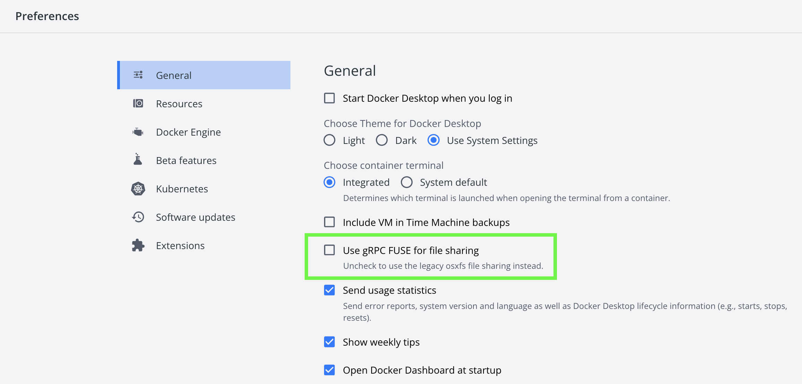

# solution-template

Many aspects of today's healthcare systems face several systemic challenges such as complex and inefficient processes, lack of interoperability, data silos, fraud and abuse, lack of transparency and so on. Decentralized (distributed ledger) blockchain technology, as opposed to traditional centralized technology systems, has the potential to reduce opacity and friction, to bring more transparency and fluidity to multiparty transactions, to unlock new sources of revenue for various constituents, and to bring industry-wide transformation to the healthcare ecosystem. 

Developers can use the `Open HealthCare-LifeScience Blockchain SDK` to greatly reduce the barrier of entry, reduce development time and resources and accelerate solution and application development in healthcare and life sciences.

This repository is a sample blockchain solution for claim management, which acts a template for solutions built on top of the `Open HealthCare-LifeScience Blockchain SDK`.

## Overview

To build an HCLS blockchain solution, several key architectural components are needed including: cloud infrastructure, smart contracts supported on Hyperledger Fabric, a REST API service layer, and optionally a UI.

- Cloud infrastructure: A HIPAA-enabled blockchain network that is built with Hyperledger Fabric that runs on a HIPAA-enabled cloud infrastructure. Although the initial deployment runs on IBM Cloud, it can support hybrid cloud infrastructures where part of the Hyperledger nodes are deployed on other cloud services, such as AWS or Azure. 
- Smart contracts supported on Hyperledger Fabric: Smart contracts are divided into two layers: 
  - The chaincode core component that contains the building blocks of the business logic and reusable modularized common functions to handle functionality such as data access, user access, patient consent, asset management, claim processing and EDI message handling, rule engine integration, transaction history, contract life cycle and error handling.
  - The solution chaincode uses these core components to build solution level business logic and high-level smart contract functions. We provide sample solution chaincode in the SDK. As a solution developer, you can focus on building your own solution code by leveraging accelerators in the lower level. 
- REST API service layer: Provides REST APIs for front-end clients to access the business logic that is implemented in the smart contract layer. This REST API layer simplifies integration with other systems without being concerned about lower-level communication details with the blockchain network. In this architecture, the REST API service layer is implemented with the popular Node.js framework, and the Hyperledger Fabric SDK module wraps all lower-level communication with the blockchain network. 
- Front-end UI: Front-end user interfaces that call REST APIs provided by the API service layer.

## Prerequisites

1. Install Go 1.12.12

Download Go for your platform:
- [Mac](https://go.dev/dl/go1.12.12.darwin-amd64.pkg)
- [Windows](https://go.dev/dl/go1.12.12.windows-amd64.msi)
- [Linux](https://go.dev/dl/go1.12.12.linux-amd64.tar.gz)

These follow [these instructions](https://go.dev/doc/install) to complete the installation.

2. Clone Hyperledger Fabric 1.4.4

```
mkdir -p $GOPATH/src/github.com/hyperledger
cd $GOPATH/src/github.com/hyperledger
git clone --branch release-1.4 https://github.com/hyperledger/fabric.git
```

3. Install NodeJS v8.x or v10.x and npm v6.x or greater

NodeJS for various platforms can be found [here](https://nodejs.org/en/download/).

Windows only:
```
npm --add-python-to-path=true install --global windows-build-tools
npm install --global grpc
```

Restart your command prompt after executing.

4. Install Docker & Docker Compose

Docker for various platforms can be found [here](https://hub.docker.com/search?type=edition&offering=community&q=).

On Mac & Windows, that installation includes Docker Compose. On Linux, follow [these instructions](https://docs.docker.com/compose/install/) to install Compose separately.

On Mac, open the Docker Desktop preferences and uncheck `Use gRPC FUSE for file sharing`.



## Quick Start
To start the solution quickly, just run these commands from the root `solution-template` directory:
```
git submodule update --init --recursive
export GOPATH=$PWD/server:$GOPATH
./scripts/restart.sh
``` 
Note: Make sure to put the solution-template repo somewhere that is not side of an existing GOPATH 

## Development Setup
This git repo two submodules called `common` and `utils` . Here's all you need to know about submodules:

#### Cloning
```
git clone https://github.com/blockchain-hcls/solution-template.git --recurse-submodules
cd solution-template
git submodule update --init --recursive
```

**Note:** It is assumed from here on that all paths are relative to the root `solution-template` directory.

#### Pulling
```
git pull --recurse-submodules
```

**Note:** This will not pull the latest version of the submodules, but rather will pull the commit that is checked into
`solution-template`. This is the intended behavior.

#### Upgrading common Submodule
If you would like to upgrade to the latest version of `common`, do this:
1. `cd chaincodes/src/solution_chaincode/vendor/common`
2. `git pull origin master`


#### Upgrading utils Submodule
If you would like to upgrade to the latest version of `utils`, do this:
1. `cd server/utils`
2. `git pull origin master`

Then commit & push the update to `solution-template` once you fix any compilation/test errors.

For more information on git submodules, see [here](https://git-scm.com/book/en/v2/Git-Tools-Submodules).

#### Using Forked Repository
If you cloned from your forked repository, use the following to add upstream in your forked repo:
1. `git remote add upstream https://github.com/blockchain-hcls/solution-template.git`
2. `git fetch upstream --recurse-submodules`

Then update your local repo from the orginal repo and update your forked repo:
1. `git pull upstream master --recurse-submodules`
2. `git push`

#### Building Go Code
First, add the Go code to your `GOPATH`. From `solution-template`, run:
```
export GOPATH=$PWD/chaincodes:$GOPATH
```

Then build the code with:
```
go build --tags nopkcs11 ./...
```

#### Running Go Tests
```
go test --tags nopkcs11 ./...
```

#### Formatting Go Code
```
go fmt ./...
```

**Note:** Always format your Go code before opening a Merge Request!

#### Building NodeJS Code
Install npm dependencies and link modules (from project's root folder):
```
npm run setup
```

#### Building the React App
This will build all the React code under the `src` folder and create an optimized production build under the `build` folder:
```
npm run build
```

#### Starting the Local Hyperledger Fabric Network
This will bring up Fabric's `Orderer`, `Peer`, and `Certificate Authority` containers, and then create channel and install chaincode:

```
cd network_local_HF
IMAGE_TAG=1.4 docker-compose -f docker-compose-e2e.yaml pull
./byfn.sh up -f docker-compose-e2e.yaml
```

When you see the following message, type in `y` and hit enter to continue:
```
Starting and building network for channel 'mychannel' with CLI timeout of '10' seconds and CLI delay of '3' seconds
Continue? [Y/n] 

```

You will see a message like the following when everything is successfule:
```
========= All GOOD, BYFN execution completed =========== 


 _____   _   _   ____   
| ____| | \ | | |  _ \  
|  _|   |  \| | | | | | 
| |___  | |\  | | |_| | 
|_____| |_| \_| |____/  

```

#### Stoping the Local Hyperledger Fabric Network
This will bring down Fabric's `Orderer`, `Peer`, and `Certificate Authority` containers, and delete all data:
```
cd network_local_HF
./byfn.sh down -f docker-compose-e2e.yaml
``` 

**Note:** Default version of Hyperlebger Fabric is `1.4` for `./byfn.sh` script. If you want to use a different version, include `-i IMAGE_TAG` parameter.

For example, to use Hyperledger Fabric version `1.1.0`:

```
cd network_local_HF
IMAGE_TAG=1.1.0 docker-compose -f docker-compose-e2e.yaml pull
./byfn.sh up -f docker-compose-e2e.yaml -i 1.1.0

./byfn.sh down -f docker-comose-e2e.yaml -i 1.1.0
```
    
#### Running the NodeJS App
This will call `invoke setup` and start the web server.
Make sure to run the following commands in a new terminal:
```
cd server
node server.js
```

**Note:** Make sure that you have correct settings in your configuration files (config.js, config.json, etc.) if you are chainging Hyperleger Fabric version.

#### Access UI
Once you see this:
```
[INFO] app.js: - ------------------------------------------------
[INFO] app.js: -  SERVER READY
[INFO] app.js: - ------------------------------------------------
```
you can access the UI at `localhost:3000` and the swagger APIs at `localhost:3000/api-docs`. 

Login creds:
- As app admin `AppAdmin/Org1/mychannel : pass0`. 
- As app Hao `Hao/Org1/mychannel : pass0`. 
- As app Alex `Alex/Org2/mychannel : pass0`. 
- As app Bonnie `Bonnie/Org2/mychannel : pass0`. 

Enjoy!

## Convenience Scripts
- `./scripts/cleanup.sh`: Cleans up docker & temporary directories.
  - Brings down and removes Fabric docker containers
  - Deletes `tmp` & `keyValStore_peerOrg1` directories
- `./scripts/restart.sh`: Cleans up _everything_ and starts the server.
  - Brings down and removes Fabric docker containers
  - Deletes `tmp` & `keyValStore_peerOrg1` directories
  - Starts new Fabric containers
  - Builds NodeJS code
  - Builds React App
  - Starts the server
- If your host is Linux, you should run the restart script with `no_cloudant_mapping` option and then manually start Cloudant (if you are using a Cloudant datastore). 

## Tutorials

The following [tutorials](./tutorials.md) guide you through the end to end development of a smart contract using the `Open HealthCare-LifeScience Blockchain SDK`.